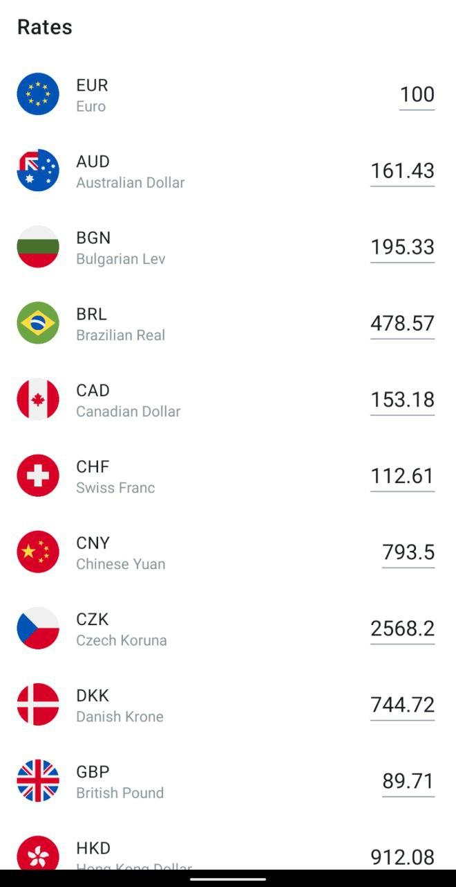

# Xchanger
Application that displays currency exchange rates that update in real time every second. [APK download links.](https://github.com/steelahhh/Xchanger/releases/tag/0.0.1)

 

## Technologies used 
- Multi-module architecture, with packaging by feature. Each module is responsible for only certain set of operations, but recurring or common to all modules tasks could be extracted into a separate module.
- MVVM via airbnb/MvRx. The library allows for easy state managment and persistance.
- Dagger2 for DI
- AdapterDelegates for reducing RecyclerView boilerplate 
- RxJava
- Moshi for JSON parsing
- Retrofit

## What could be improved 
- Navigation. Whenever the need for more complex navigation arises, it could be done by either introducing some library (i.e. AAC Navigation), or by wrapping the FragmentManater and using its APIs. Inter-module navigation could be achieved by introducing an interface with navigation routes/actions in the feature module, that the app or flow-common module implements.
- Maybe persist selected currency with the value
- Persist polling rate, so it's not static and could be configured via some remote service
- UI + integration testing
